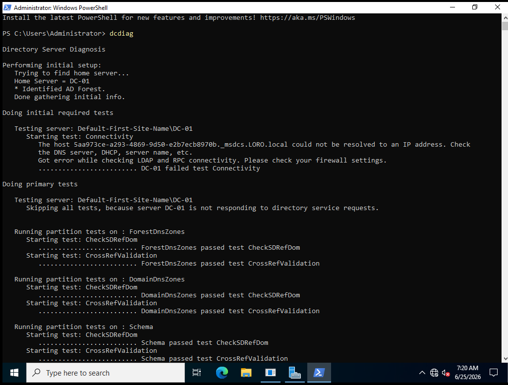
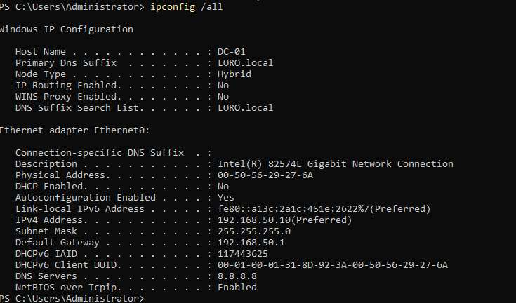
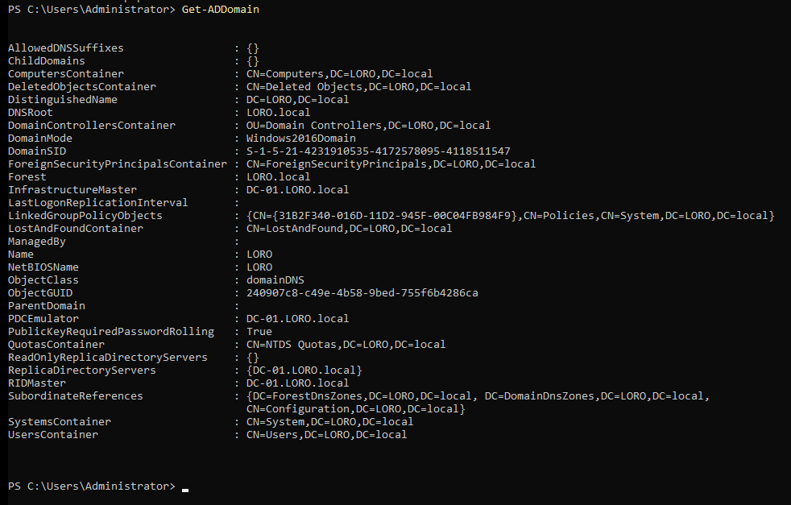
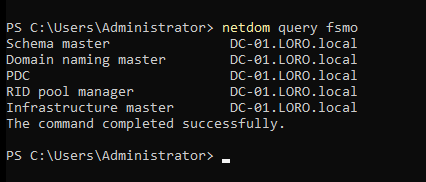
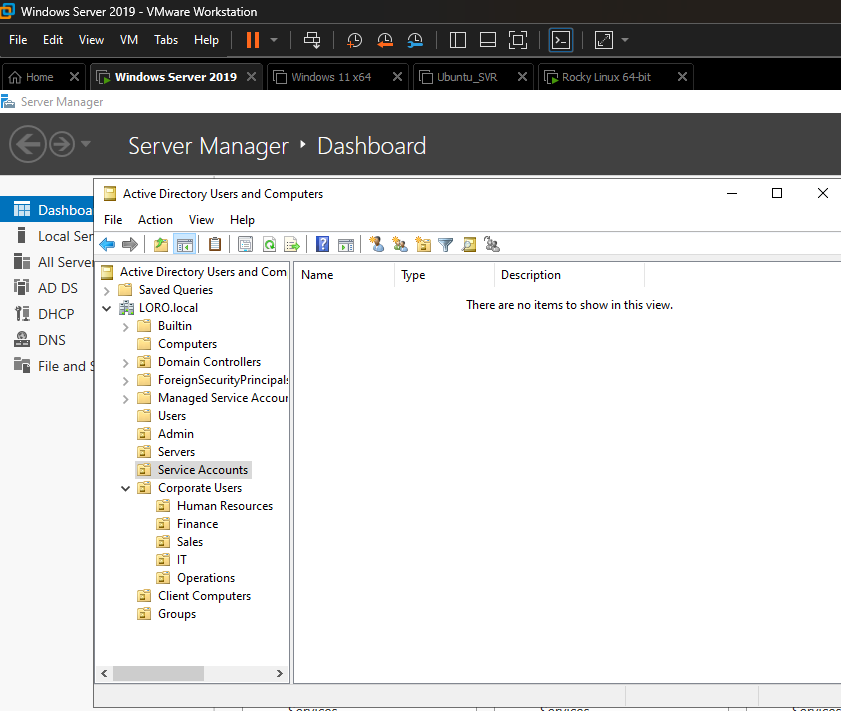
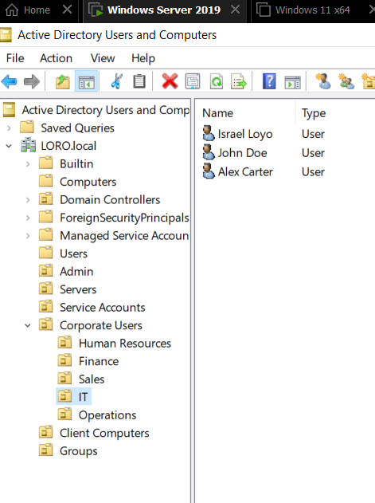
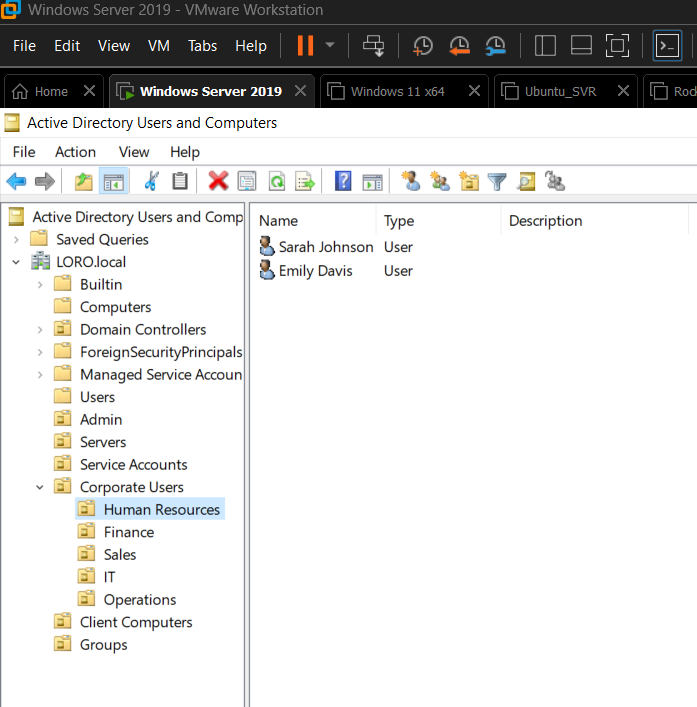
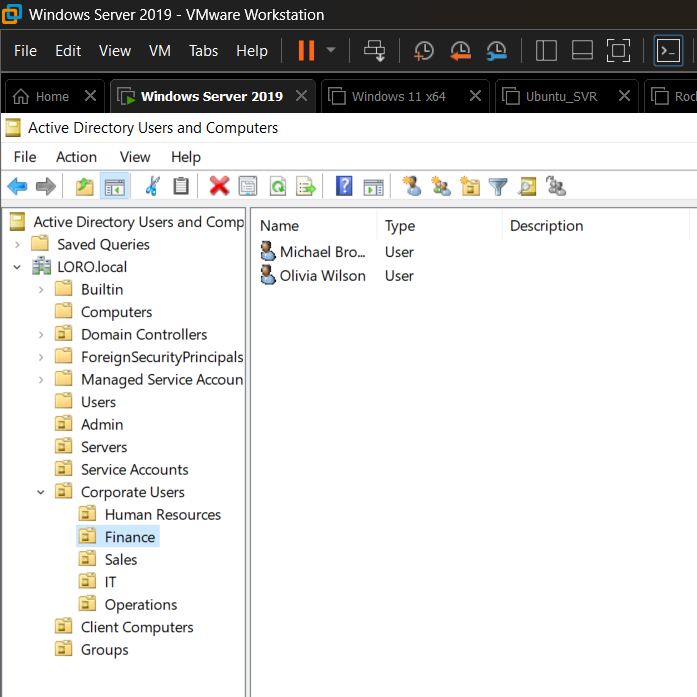
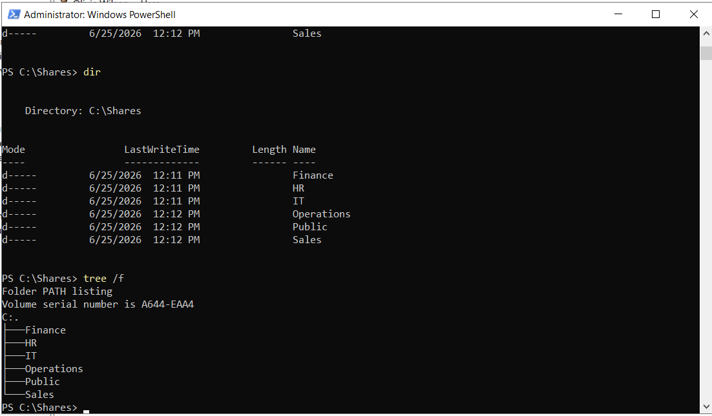

# 🏢 Enterprise Systems Administration Lab

## Overview

This repository documents the design, deployment, administration, and troubleshooting of a multi-platform enterprise lab built using **VMware Workstation**.

The project simulates the IT infrastructure of a small business and demonstrates practical skills used by **Help Desk Technicians, IT Support Specialists, Desktop Support Technicians, and Junior Systems Administrators**.

The environment includes **Windows Server 2019**, **Windows 11**, **Ubuntu Server 24.04**, and **Rocky Linux 9**, with a focus on Active Directory administration, Windows infrastructure, Linux administration, networking, and technical documentation.

---

# Lab Objectives

* Build an enterprise Active Directory environment
* Configure Windows Server infrastructure
* Implement Role-Based Access Control (RBAC)
* Configure DNS and DHCP
* Create shared folders and NTFS permissions
* Join Windows clients to the domain
* Administer Ubuntu Server
* Administer Rocky Linux
* Document every implementation with screenshots and technical notes

---

# Infrastructure

## Virtualization

* VMware Workstation Pro

## Windows Environment

* Windows Server 2019
* Active Directory Domain Services
* DNS Server
* DHCP Server
* Group Policy Management
* File Services
* Windows 11 Enterprise Client

## Linux Environment

* Ubuntu Server 24.04
* Rocky Linux 9

---

# Enterprise Skills Demonstrated

## Windows Server

* Active Directory Administration
* Organizational Unit (OU) Design
* User & Group Administration
* Role-Based Access Control (RBAC)
* DNS Administration
* DHCP Administration
* Group Policy Management
* NTFS Permissions
* Shared Folder Administration
* Windows Server Management
* Windows 11 Domain Administration

## Linux Administration

* User and Group Management
* SSH Administration
* Apache Web Server
* Nginx Web Server
* File Permissions
* System Services
* Log Analysis
* Basic Security Hardening

## Networking

* TCP/IP Configuration
* DNS Resolution
* DHCP Configuration
* Network Troubleshooting

---

# Repository Structure

```text
Enterprise-System-Administration-Lab
│
├── Active-Directory
├── Documentation
├── Ubuntu
├── Rocky-Linux
├── Screenshots
└── README.md
```

---

# Active Directory Project

## Completed

* Domain Health Assessment
* Forest Verification
* FSMO Role Verification
* Enterprise OU Structure
* Department Organizational Units
* Security Groups
* Enterprise User Accounts
* Role-Based Access Control (RBAC)

## In Progress

* File Server
* NTFS Permissions
* DHCP Configuration
* Group Policy
* Password Policies
* Windows 11 Administration

---

# Active Directory Screenshots

## Domain Controller Health



---

## IP Configuration



---

## Active Directory Domain



---

## Active Directory Forest


---

## FSMO Roles



---

## Enterprise OU Structure



---

## Security Groups


---

## IT Department



---

## Human Resources



---

## Finance Department



---

## Enterprise File Server



---

# Technologies Used

* Windows Server 2019
* Windows 11
* Ubuntu Server 24.04
* Rocky Linux 9
* Active Directory
* DNS
* DHCP
* Group Policy
* VMware Workstation
* PowerShell
* Git
* GitHub
* Visual Studio Code

---

# Future Enhancements

* Windows Deployment Services (WDS)
* WSUS
* File Server Resource Manager (FSRM)
* Print Services
* DFS Namespace
* Certificate Services (AD CS)
* Linux Automation with Bash
* PowerShell Automation
* Monitoring and Logging
* Backup and Recovery

---

# Author

**Israel Loyo**

* CompTIA Security+
* Cisco CCNA Candidate
* IT Support | Desktop Support | Systems Administration
