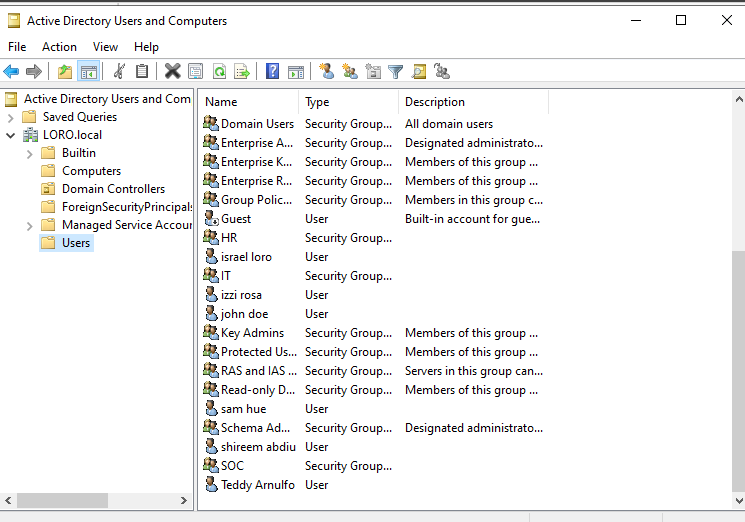
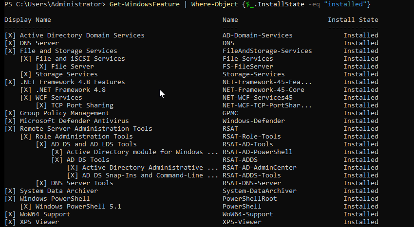
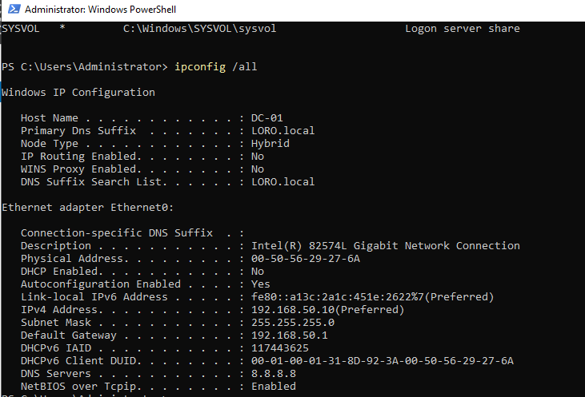

# Windows Server Audit Report

## Project

Windows & Linux Administration Lab

## Auditor

Israel Loyo

## Audit Date

June 2026

---

# Server Information

| Item         | Value         |
| ------------ | ------------- |
| Hostname     | DC-01         |
| Domain       | LORO.local    |
| IPv4 Address | 192.168.50.10 |
| Gateway      | 192.168.50.1  |
| DNS Server   | 8.8.8.8       |
| DHCP Enabled | No            |

---

# Installed Roles

| Role                             | Status    |
| -------------------------------- | --------- |
| Active Directory Domain Services | Installed |
| DNS Server                       | Installed |
| File Server                      | Installed |
| Group Policy Management          | Installed |

---

# Active Directory Assessment

## Existing Users

* Israel loro
* john doe
* sam hue
* izzi rosa
* shireen abdiu
* Teddy Arnulfo

## Existing Groups

* HR
* IT
* SOC

---

# Network Assessment

Current Configuration:

* Static IP Address Configured
* Active Directory Operational
* DNS Role Installed
* DHCP Role Not Installed

---

# Findings

## Strengths

* Domain Controller operational
* Active Directory installed
* DNS installed
* File Services installed
* Group Policy Management installed

## Improvements Required

* Verify DNS configuration
* Install DHCP role
* Create Organizational Unit structure
* Create departmental groups
* Configure Group Policies
* Create shared folders
* Document server configuration

---

# Next Actions

* Perform DNS audit
* Install DHCP Server
* Build enterprise OU structure
* Create departmental users
* Configure password policies
* Configure Group Policy Objects (GPOs)

---

# Screenshots

## Active Directory Users and Computers

## Installed Windows Roles

## Network Configuration

